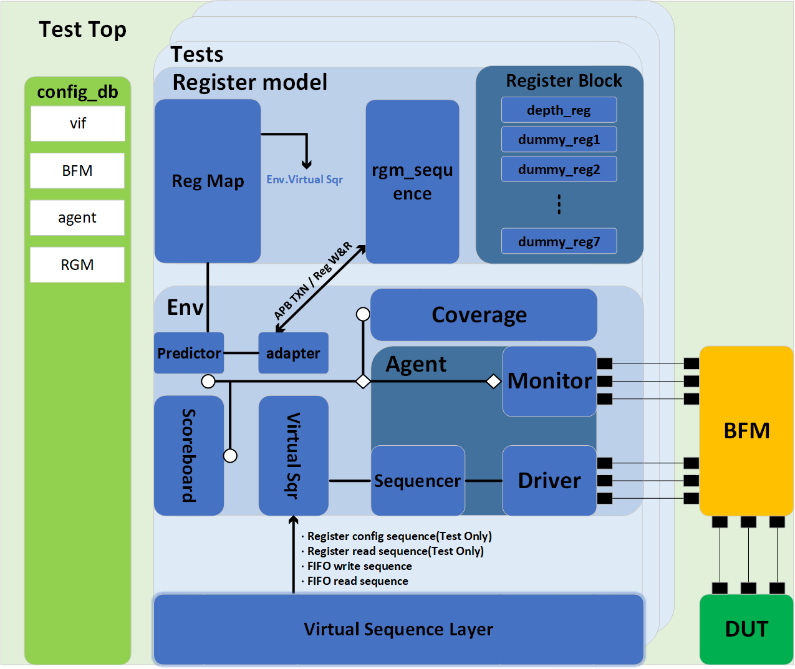

# 
 UVM Project of APB Sync FIFO with Depth Reg 
  

 <b> Haibo Li @ Rice University 

## Contents 
- Introduction 
- DUT Structure  
- UVM Structure
- Verification Plan  
- Results

## Introduction 
This project implements a UVM-based functional verification environment for a programmable-depth synchronous FIFO with an AMBA 4.0 APB interface. The DUT supports dynamic configuration of FIFO depth through a memory-mapped register block.

In addition to the test plan and functional coverage, a detailed [development log](./doc/projlog.txt) is maintained with daily records of design decisions, debug sessions, and milestone tracking.

## DUT Structure

  

  
DUT Structure

  

The DUT consists of an APB register interface, a configurable-depth synchronous FIFO, and a register block with 8 memory-mapped registers. The depth_reg field controls FIFO depth, which dynamically adjusts buffer size during operation. 

## UVM Structure

  

  
UVM Structure

 

The UVM environment includes a configurable agent, sequencer, driver, monitor, bfm, scoreboard, coverage collector, and register model integration via adapter and predictor. A virtual sequence and a virtual sequencer coordinate multiple functional tests including register access, FIFO write/read, and reset scenarios. The register model is fully integrated using UVM_RGM and supports frontdoor/backdoor access with coverage hooks.

## Verification Plan
### Register Model Verification Plan

| TestID | Description                                  | Method    | Stimulus                                             | Expected Result                     | Status | Make CMD |
|--------|----------------------------------------------|-----------|------------------------------------------------------|-------------------------------------|--------|----------|
| REG_01 | Read the default value of reg0               | Frontdoor | reg0.read()                                          | Return 0x0000_0001                  |   PASS|make          |
| REG_02 | Write & read back of reg0                    | Frontdoor | reg0.write() reg0.read()                             | Return write value                  |PASS      |make          |
| REG_03 | Write & read back of reg0 field only | Frontdoor | reg0.depth_sel_fld.write()  reg0.depth_sel_fld.read() | Same as REG_02  since APB.PSTRB set  |PASS      |make          |
| REG_04 | Write corner values then read                | Frontdoor | reg0.write() reg0.read()                             | Return write values                 |PASS      |make          |
| REG_05 | Write illegal values to reg0                 | Frontdoor | reg0.write()                                         | Depth is set to 8                   |PASS      |make TESTID=REG_05          |
| REG_06 | Write illegal addresses of RGM               | Frontdoor | reg0.write()                                         | Error flagged                       |PASS      |make TESTID=REG_06          |
| REG_07 | Back door write, frontdoor read              | Mixed     | reg0.write(BACKDOOR) reg0.read()                     | Display write value                 |PASS      |make TESTID=REG_07          |
| REG_08 | Read all dummy_regs                          | Frontdoor | dummy_reg[i].read()                                  | Return 0x0000_0000                  |PASS      |make TESTID=REG_08          |
| REG_09 | Mirror and compare                           | Frontdoor | reg0.set() reg0.mirror()                             | Mirror matches DUT                  |PASS      |make TESTID=REG_09          |
| REG_10 | Coverage bins for depth_sel_fld              | Coverage  | Cover all legal field values                         | All bins hit                        |      |          |

### FIFO Verification Plan

## Results

